# CollabCanvas - System Architecture

## Complete System Architecture Diagram

```mermaid
graph TB
    subgraph "Client Browser"
        subgraph "Next.js Frontend (React)"
            UI[User Interface Layer]
            
            subgraph "Pages (App Router)"
                Home[Home Page<br/>Landing & Auth]
                Dashboard[Dashboard Page<br/>Canvas Workspace]
            end
            
            subgraph "React Components"
                Canvas[Canvas Component<br/>Main workspace]
                Toolbar[Toolbar<br/>Shape tools]
                PresencePanel[Presence Panel<br/>Online users]
                MultiCursor[Multiplayer Cursors<br/>Real-time cursors]
                ShapeRenderer[Shape Renderer<br/>Draw rectangles]
            end
            
            subgraph "Custom Hooks"
                useViewport[useViewport<br/>Pan/zoom state]
                useShapes[useShapes<br/>Shape CRUD]
                usePresence[usePresence<br/>User presence]
                useKeyboard[useKeyboard<br/>Shortcuts]
                useThrottle[useThrottle<br/>Rate limiting]
            end
            
            subgraph "Utilities"
                CanvasUtils[Canvas Utils<br/>Coordinate transforms]
                ShapeUtils[Shape Utils<br/>Collision detection]
                ColorUtils[Color Utils<br/>Palette management]
            end
        end
        
        LocalStorage[(Local Storage<br/>Viewport state)]
    end
    
    subgraph "Authentication Layer"
        Clerk[Clerk Auth Service<br/>User management]
        ClerkProvider[Clerk Provider<br/>React context]
        ClerkMiddleware[Clerk Middleware<br/>Route protection]
    end
    
    subgraph "Convex Backend"
        ConvexClient[Convex Client<br/>Real-time subscriptions]
        
        subgraph "Convex Functions"
            ShapeQueries[Shape Queries<br/>getShapes, getShape]
            ShapeMutations[Shape Mutations<br/>createShape, moveShape, deleteShape]
            PresenceQueries[Presence Queries<br/>getActiveUsers]
            PresenceMutations[Presence Mutations<br/>updatePresence, joinCanvas, leaveCanvas]
        end
        
        subgraph "Convex Database"
            ShapesTable[(Shapes Table<br/>Shape data)]
            PresenceTable[(Presence Table<br/>User cursors & status)]
        end
        
        subgraph "Convex Background Jobs"
            PresenceCron[Presence Cleanup Cron<br/>Remove stale users every 10s]
        end
        
        ConvexAuth[Convex Auth<br/>JWT validation]
    end
    
    subgraph "Deployment Infrastructure"
        Vercel[Vercel<br/>Next.js hosting]
        ConvexCloud[Convex Cloud<br/>Backend hosting]
        ClerkCloud[Clerk Cloud<br/>Auth hosting]
    end

    %% Client to Components Flow
    UI --> Home
    UI --> Dashboard
    Dashboard --> Canvas
    Dashboard --> Toolbar
    Dashboard --> PresencePanel
    Canvas --> MultiCursor
    Canvas --> ShapeRenderer
    
    %% Components to Hooks Flow
    Canvas --> useViewport
    Canvas --> useShapes
    Canvas --> usePresence
    Canvas --> useKeyboard
    usePresence --> useThrottle
    
    %% Hooks to Utils Flow
    useViewport --> CanvasUtils
    useShapes --> ShapeUtils
    usePresence --> ColorUtils
    
    %% Local Storage
    useViewport -.->|Save/Load viewport| LocalStorage
    
    %% Authentication Flow
    Home --> ClerkProvider
    Dashboard --> ClerkMiddleware
    ClerkProvider --> Clerk
    ClerkMiddleware --> Clerk
    Clerk -.->|JWT token| ConvexAuth
    
    %% Convex Integration
    useShapes -->|Subscribe & Mutate| ConvexClient
    usePresence -->|Subscribe & Mutate| ConvexClient
    
    ConvexClient -->|Real-time updates| ShapeQueries
    ConvexClient -->|Real-time updates| PresenceQueries
    ConvexClient -->|Execute| ShapeMutations
    ConvexClient -->|Execute| PresenceMutations
    
    %% Convex to Database
    ShapeQueries --> ShapesTable
    ShapeMutations --> ShapesTable
    PresenceQueries --> PresenceTable
    PresenceMutations --> PresenceTable
    
    %% Background Jobs
    PresenceCron -->|Cleanup old records| PresenceTable
    
    %% Auth Integration
    ConvexAuth -.->|Validate user| ShapeMutations
    ConvexAuth -.->|Validate user| PresenceMutations
    
    %% Deployment
    UI -.->|Deployed on| Vercel
    ConvexClient -.->|Connects to| ConvexCloud
    Clerk -.->|Hosted on| ClerkCloud

    style UI fill:#3b82f6,stroke:#1e40af,stroke-width:3px,color:#fff
    style ConvexClient fill:#8b5cf6,stroke:#6d28d9,stroke-width:3px,color:#fff
    style Clerk fill:#ef4444,stroke:#b91c1c,stroke-width:3px,color:#fff
```

---

## Data Flow Diagrams

### 1. User Authentication Flow

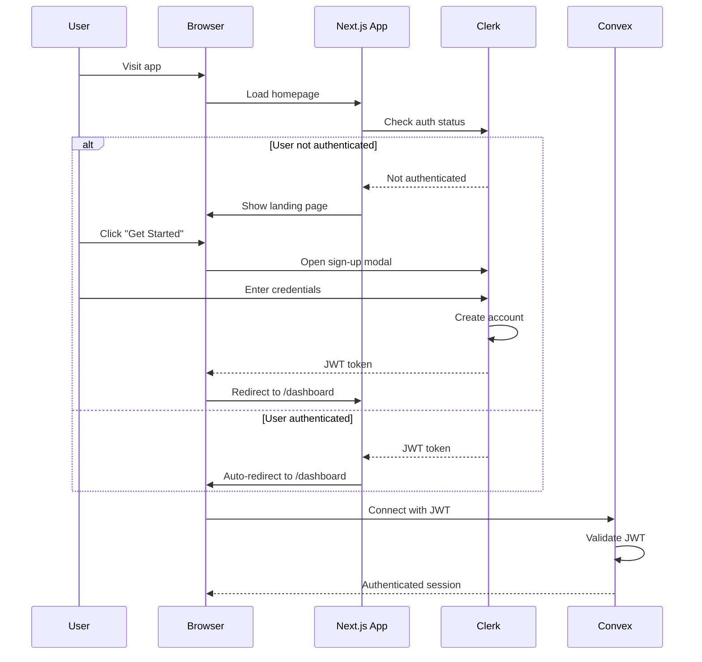

---

### 2. Real-Time Shape Creation & Sync Flow

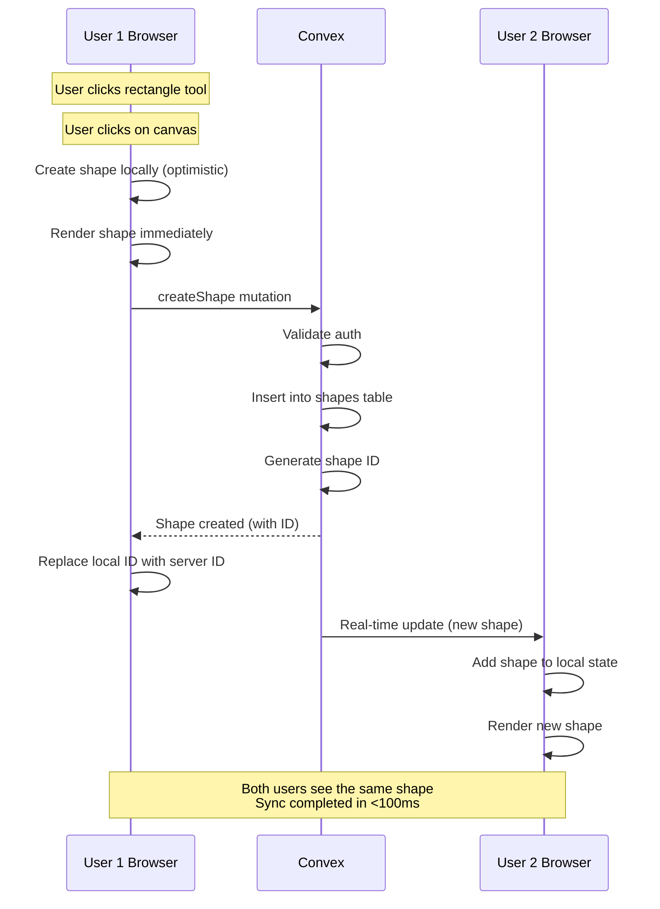

---

### 3. Multiplayer Cursor Synchronization Flow

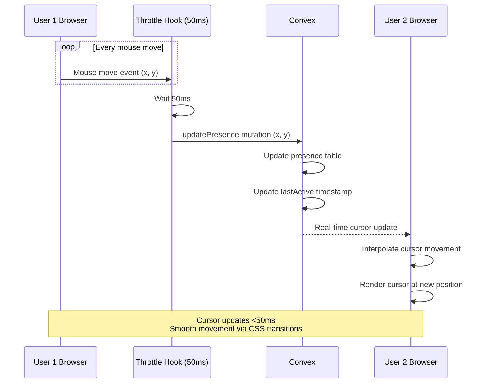

---

### 4. Presence Management & Cleanup Flow

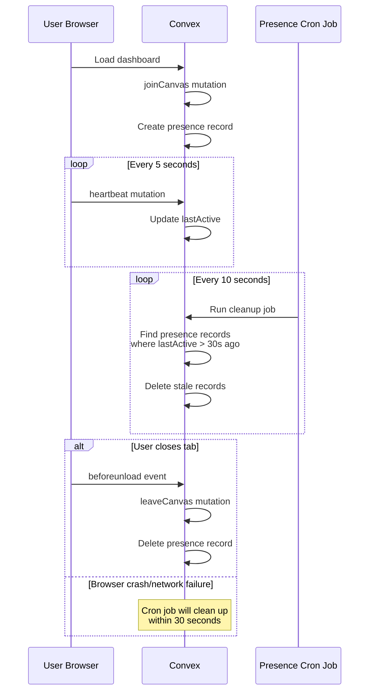

---

## Component Interaction Diagram

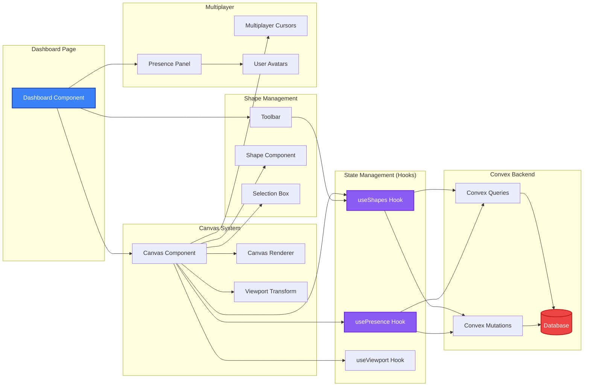

---

## Database Schema Diagram

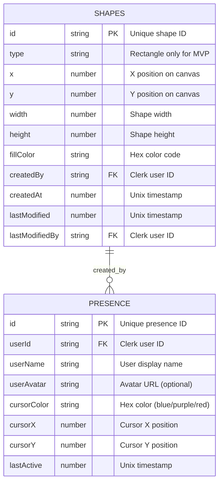

---

## Technology Stack Diagram

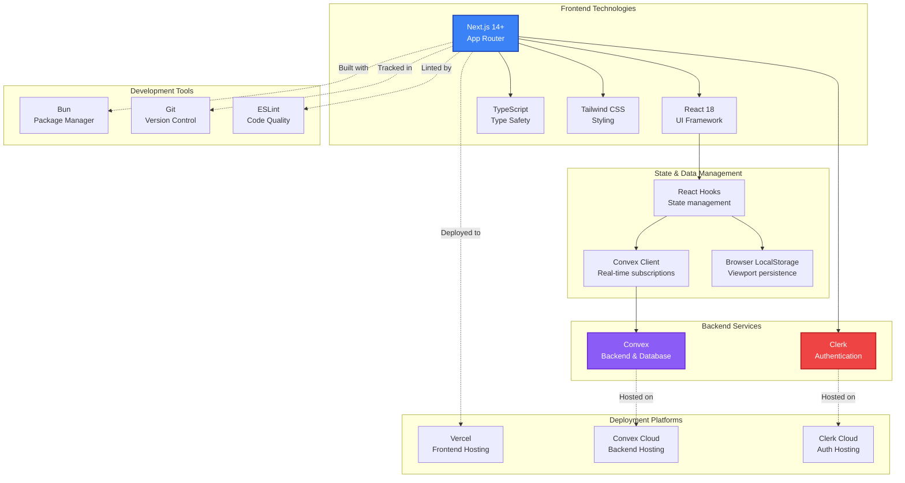

---

## Canvas Coordinate System Diagram

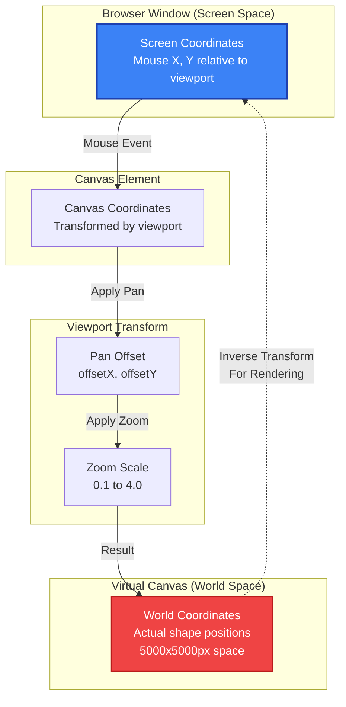

---

## State Management Flow

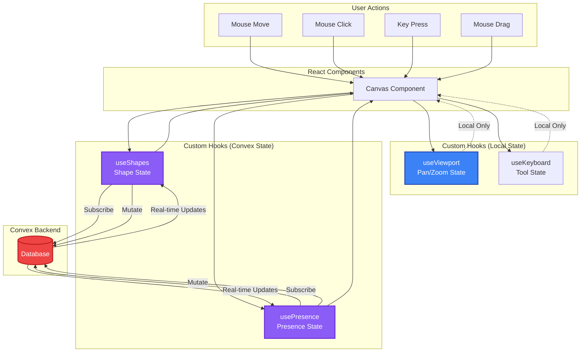

---

## Request/Response Flow with Optimistic Updates

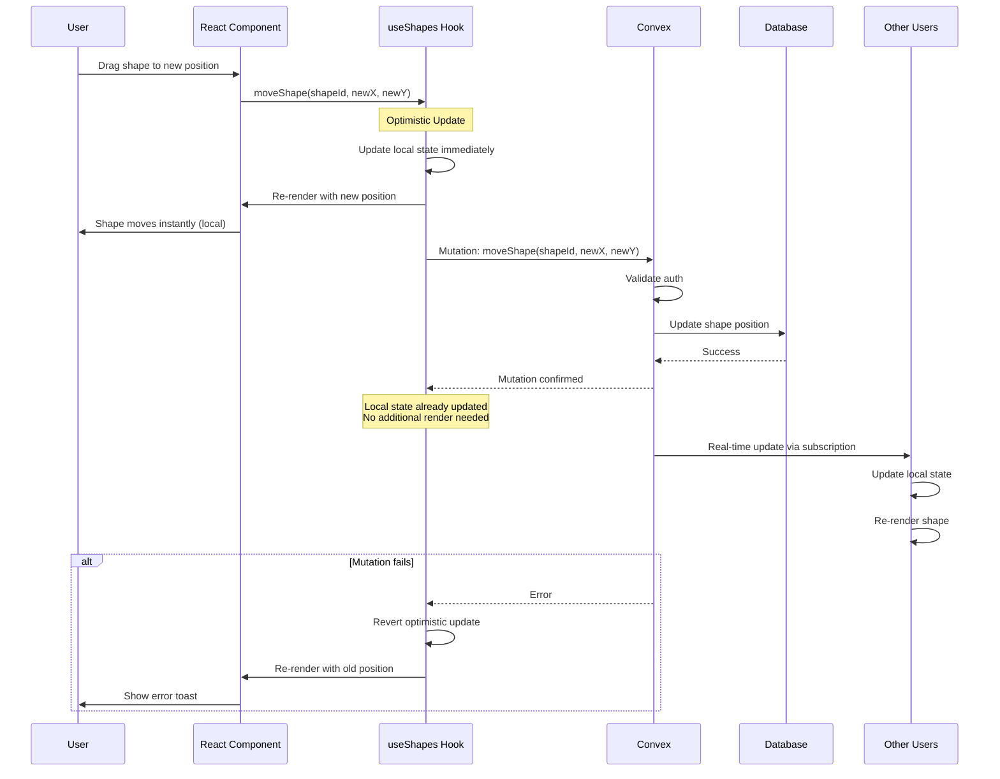

---

## Network Communication Patterns

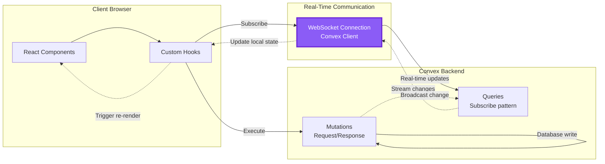

---

## File Structure to Architecture Mapping

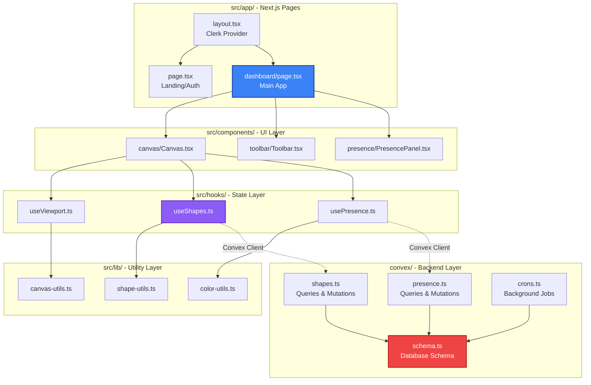

---

## Key Architectural Decisions

### 1. **State-Based Sync vs Operational Transform**
- **Decision:** Use state-based sync with "last write wins"
- **Rationale:** Simpler to implement, sufficient for shape position/properties
- **Trade-off:** Less sophisticated conflict resolution, but acceptable for MVP

### 2. **Optimistic Updates**
- **Decision:** Apply changes locally before server confirmation
- **Rationale:** Provides instant feedback, improves perceived performance
- **Implementation:** Revert on error, reconcile with server state

### 3. **Throttled Cursor Updates**
- **Decision:** Throttle cursor position updates to 50ms intervals
- **Rationale:** Reduces network traffic and server load
- **Trade-off:** Slightly less real-time, but smooth via CSS interpolation

### 4. **Single Shared Canvas**
- **Decision:** One global canvas for all users (no per-user canvases)
- **Rationale:** Simplifies MVP, focuses on core collaboration features
- **Future:** Can add multi-canvas support post-MVP

### 5. **Client-Side Viewport Management**
- **Decision:** Store viewport state (pan/zoom) in localStorage, not database
- **Rationale:** Viewport is per-user preference, not shared state
- **Benefit:** Reduces server load, instant viewport restore

### 6. **Presence Cleanup via Cron**
- **Decision:** Background job removes stale presence records every 10 seconds
- **Rationale:** Handles ungraceful disconnects (browser crash, network failure)
- **Fallback:** Client-side cleanup on beforeunload (best effort)

---

## Performance Optimizations

```mermaid
graph TB
    subgraph "Rendering Optimizations"
        ViewportCulling[Viewport Culling<br/>Only render visible shapes]
        RequestAnimFrame[requestAnimationFrame<br/>60 FPS render loop]
        ReactMemo[React.memo<br/>Prevent unnecessary re-renders]
    end
    
    subgraph "Network Optimizations"
        Throttling[Throttle cursor updates<br/>50ms intervals]
        OptimisticUI[Optimistic UI updates<br/>Instant local feedback]
        WebSocketReuse[WebSocket connection reuse<br/>Single connection for all data]
    end
    
    subgraph "Data Optimizations"
        Indexing[Database indexes<br/>Fast queries]
        LocalStorageCache[localStorage cache<br/>Viewport state]
    end
    
    ViewportCulling --> RequestAnimFrame
    RequestAnimFrame --> ReactMemo
    
    Throttling --> OptimisticUI
    OptimisticUI --> WebSocketReuse
    
    Indexing --> LocalStorageCache
```

---

## Error Handling & Resilience

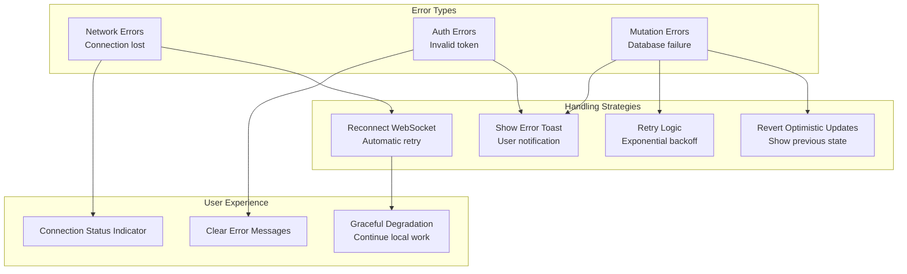

---

## Security Architecture

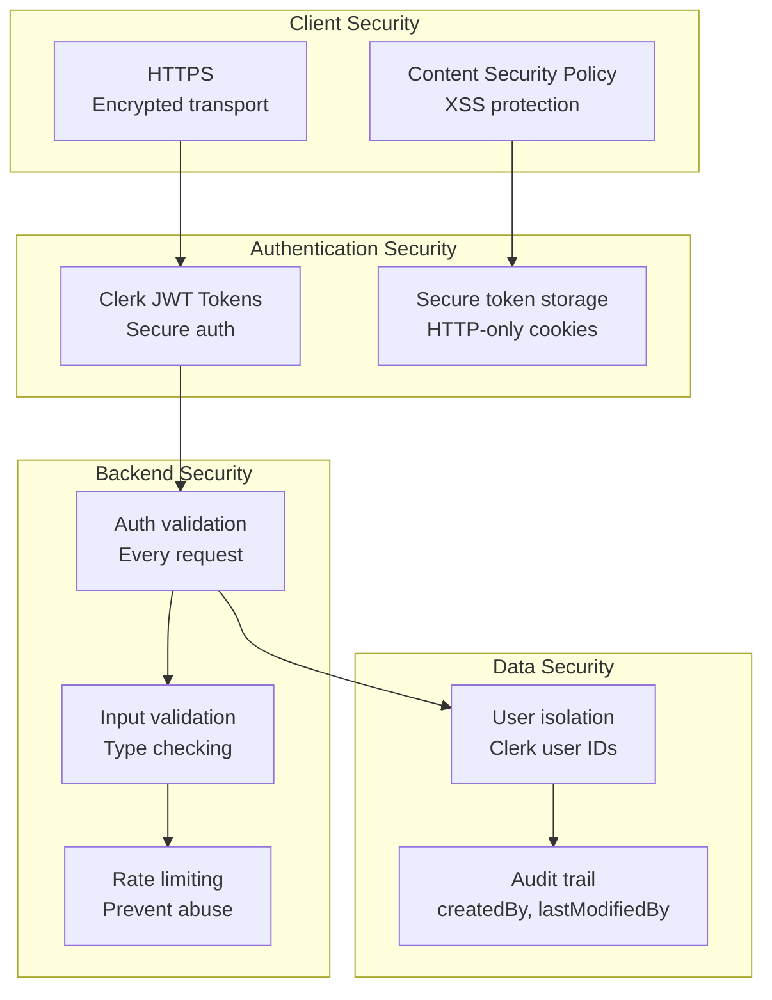

---

## Deployment Architecture

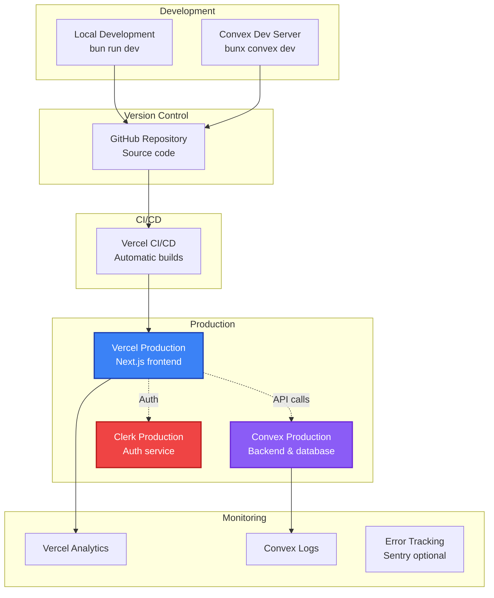

---

## Summary

This architecture provides:

1. **Real-time collaboration** via Convex WebSocket subscriptions
2. **Instant feedback** via optimistic updates
3. **Smooth performance** via viewport culling and throttling
4. **Secure authentication** via Clerk JWT tokens
5. **Scalable infrastructure** via Vercel + Convex Cloud
6. **Simple state management** via custom React hooks
7. **Type safety** via TypeScript end-to-end
8. **Developer experience** via Bun and modern tooling

The architecture is designed to be:
- **Simple:** Minimal dependencies, clear separation of concerns
- **Scalable:** Can handle 5+ concurrent users, 500+ shapes
- **Maintainable:** Modular components, clear data flow
- **Extensible:** Easy to add features post-MVP (AI agent, more shapes, etc.)